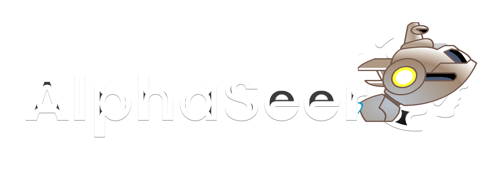
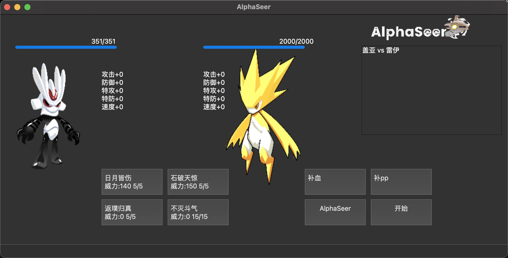

一个私人赛尔对战 Ai

## 文件目录

- img: 雷伊和盖亚的图片
- model: 模型训练结果的文件夹
    - `DQN_Seer.zip`: AlphaSeer 的模型
    - `DQN_Seer_best.zip`: AlphaSeer 最好的模型
- src: 源代码的文件夹
    - `battle_cmd.py`: 在命令行中测试模型效果的代码
    - `gen_model.py`: 生成模型的代码
    - `genie.py`: 精灵属性
    - `logon_new.py`: 幼稚版赛尔号实现与AlphaSeer实现逻辑函数

## 运行方式

### 安装环境

使用 pytorch 运行强化学习的环境
```shell
conda create -n seer python=3.9
conda activate seer

#GPU
conda install pytorch torchvision torchaudio pytorch-cuda=11.8 -c pytorch -c nvidia
#CPU
conda install pytorch torchvision torchaudio cpuonly -c pytorch
#MAC
conda install pytorch::pytorch torchvision torchaudio -c pytorch

#国内安装可加上清华源
pip install gymnasium -i https://pypi.tuna.tsinghua.edu.cn/simple
pip install stable_baselines3 -i https://pypi.tuna.tsinghua.edu.cn/simple
pip install pyQt6 -i https://pypi.tuna.tsinghua.edu.cn/simple
```

使用 tensorboard 查看训练过程
```shell
conda install -c conda-forge tensorboard
```

### 运行

生成模型

```shell
python src/gen_model.py
```

使用 Tensorboard 查看模型训练过程

```shell
tensorboard --logdir logs serve
```

在命令行中测试模型

```python
python src/battle_cmd.py
```

打开 pyqt6 测试模型效果

```shell
python src/logon_new.py
```




## 其他说明

未经许可，禁止用于任何商业用途，请遵循GPL3.0协议
